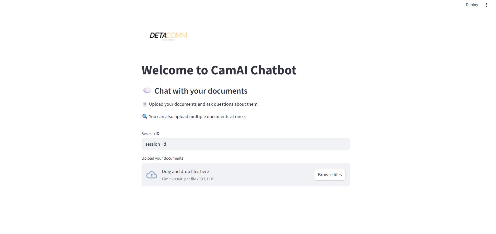

# DetaComm CamAI Chat Bot

## UI Preview



A Streamlit-based AI assistant that lets you chat with your uploaded documents using:

- Groq LLM (`llama-3.3-70b-versatile`)
- FAISS vector store
- HuggingFace sentence embeddings (`all-MiniLM-L6-v2`)

---

## How to run

```bash
pip install -r requirements.txt
streamlit run app.py


GROQ_API_KEY=your_groq_api_key_here
HF_TOKEN=your_huggingface_token_here  # if needed
OPENAI_API_KEY=optional


Then in your terminal:

```bash
git add README.md
git commit -m "Add README with UI preview"
git push


